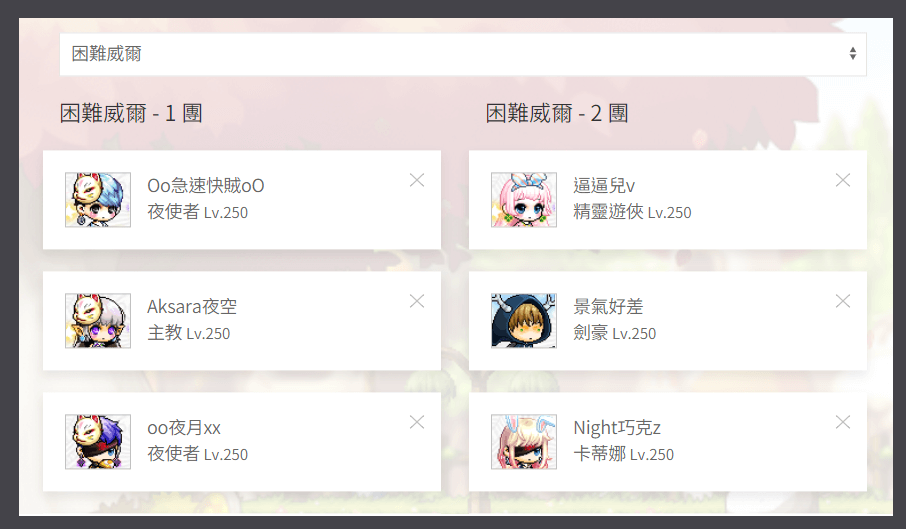
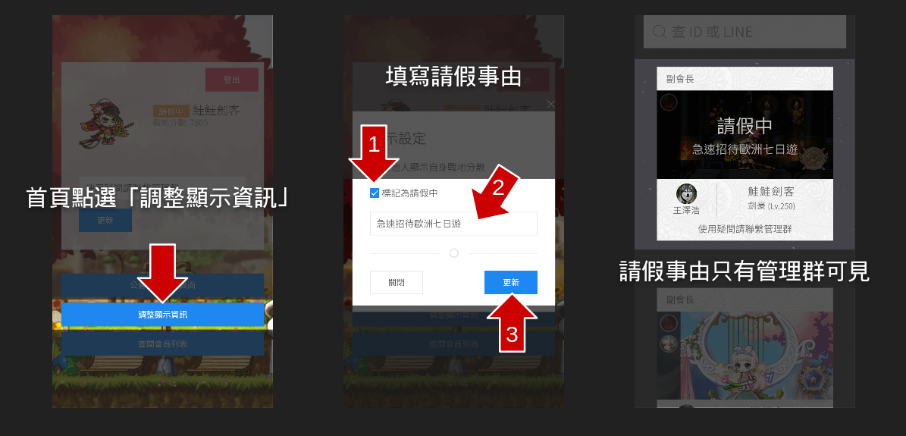

This is a guide management system for MMORPG MapleStory (TMS).

## Member Management

Game avatar and its union info integrate with LINE profile.

* Avatar and union level is crawled from official data.
* LINE profile is based on user registration on this system.
* **Guide member** customizes their moods by text.


## Team Management

**Guide manager** can manage party members for each BOSS teams.

* Easy drag and drop interation.
* Real-time update to member list and team list.




## Leave Management

**Guide member** can submit their reason when they want to take a leave.

* Only show the reason to **guide member**



---

# Requirements

## LINE Login settings

1. Go to LINE developer https://developers.line.me/
2. Add new provider or use exist provider
3. Create new channel > LINE Login
4. [tab] App settings > Enter your **Callback URL**
5. [tab] Channel settings > Copy **Channel ID** and **Channel secret**

```shell
$ export LINE_CHANNEL_ID="your Callback URL"
$ export LINE_CHANNEL_SECRET="your Channel ID"
$ export LINE_CALLBACK_URL="your Channel secret"
```

## Google APIs settings

### API keys

Quick access (readonly) to Google spreadsheet without other auth by using API keys.

1. Go to Google APIs https://console.developers.google.com/
2. New Project (if you don't have anyone)
3. Select your project > Credentials
4. Create credentials > API key > Restrict key
5. [tab] Application restrictions > None (dev) / HTTP referrers (prod)
6. [tab] API restrictions > Google Sheets API > Save
7. Copy **API key**
8. Go to Google Drive https://www.google.com/drive/
9. Create an spreadsheet, then copy **ID** and **sheet**
10. Rename `./src/config-default.ts` to `./src/config.ts`

```shell
$ export GOOGLE_APIS_API_KEY="your API key"
$ export GOOGLE_APIS_SPREADSHEET_ID="your spreadsheet ID"
$ export GOOGLE_APIS_SHEET_NAME="your sheet name"
```

### OAuth 2.0 client IDs

Offline access to your spreadsheet. Notice to protect your `credentials`, it has complete permission for your Google Spreadsheet.

1. Follow above, create another credential > OAuth client ID > Other
2. Click icon **Download JSON** of this row
3. Open this `./credentials.json` file

```shell
$ export GOOGLE_APIS_CREDENTIALS="Text in credentials.json" # Single line better
$ yarn run credentials
```


# Launching

## Run web server

```shell
$ yarn
$ yarn start
# Visit http://localhost:3000
```

## Initial your environment

Visit http://localhost:3000/system/init to finish it.


## Optional

You can try to use the same **Google API token** instead of re-generating new one everytimes.

After you visiting http://localhost:3000/system/init, copy your `./token.json` to environment variable. Like below:

```shell
$ export GOOGLE_APIS_TOKEN="Text in token.json" # Single line better
```

## Generate background sprite

```shell
$ ts-node ./src/utils/generate-sprite.ts
```
